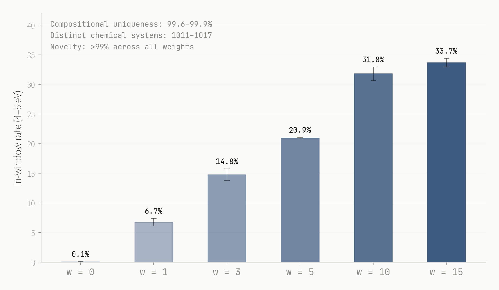

# Probe-Gradient Guidance

Test-time verification for crystal structure generation. A 256-parameter linear probe steers an unconditional diffusion model toward target material properties by backpropagating through the probe at each denoising step. No retraining. No conditional model. Swap the probe, change the target.



**Blog post**: [Scaling Test-Time Verification for Novel Materials](https://dynamicalsystems.ai/blog/scaling-test-time-verification)

## Results

On [Crystalite](https://arxiv.org/abs/2604.02270) (67.8M-parameter Diffusion Transformer, trained on Alex-MP-20):

| Guidance weight | Metal % | In-window (4-6 eV) % | Mean band gap (eV) |
|---|---|---|---|
| 0 (baseline) | 96.5 | 0.0 | -0.14 |
| 1 | 0.8 | 3.5 | 2.38 |
| 3 | 0.8 | 12.1 | 3.01 |
| 10 | 0.0 | 24.2 | 4.19 |

24.2% in-window from an unconditional model trained on 97.9% metals. Matches [MatterGen](https://www.nature.com/articles/s41586-025-08628-5) conditional generation with [self-correcting search](https://www.goodfire.ai/research/self-correcting-search) (25-28%) at ~500x the speed.

**Balanced model** (32K subset, 35% insulators): 42.6% in-window, 100% lattice validity, 99.6% geometry validity. Formation energy probe AUROC: 0.990.

## Setup

**Hardware**: Single GPU with 16+ GB VRAM (tested on NVIDIA GB10). CPU-only works for probe training and evaluation but not generation.

### 1. Clone and install

```bash
git clone https://github.com/Dynamical-Systems-Research/probe-gradient-guidance.git
cd probe-gradient-guidance
pip install -r requirements.txt
```

### 2. Install Crystalite

The scripts import from Crystalite's source tree. Clone it into the repo root:

```bash
git clone https://github.com/joshrosie/crystalite.git src
```

This places the Crystalite codebase at `src/`, which matches the import paths used throughout (e.g., `from src.crystalite.crystalite import CrystaliteModel`).

### 3. Download training data

Crystalite provides a download script for Alex-MP-20 (the dataset used in all experiments):

```bash
python src/data/download_datasets.py --datasets alex_mp20 --out data
```

This downloads from HuggingFace (`jbungle/crystalite-datasets`).

### 4. Download model checkpoints

Crystalite checkpoints (519MB each) are hosted on HuggingFace. Download and place them in the expected directory structure:

```bash
mkdir -p outputs/dng_alex_mp20/checkpoints
mkdir -p outputs/dng_balanced_100k/checkpoints

# 10K model (diversity-optimized, used for Pareto sweep)
huggingface-cli download Dynamical-Systems/crystalite-10k-alex-mp20 \
    --local-dir outputs/dng_alex_mp20/checkpoints

# Balanced model (production, 42.6% in-window)
huggingface-cli download Dynamical-Systems/crystalite-balanced-100k \
    --local-dir outputs/dng_balanced_100k/checkpoints
```

### 5. Pre-trained probes (included)

Trained probes are included in `probes/`. You can skip probe training and go directly to generation.

| Probe | Model | Property | AUROC |
|---|---|---|---|
| `probes/bandgap_10k.pt` | Crystalite 10K | Band gap | 0.957 |
| `probes/bandgap_balanced.pt` | Crystalite balanced | Band gap | ~0.95 |
| `probes/formation_energy_balanced.pt` | Crystalite balanced | Formation energy | 0.990 |
| `probes/bandgap_mattergen.pt` | MatterGen | Band gap | 0.972 |

## Usage

### Train a new probe

```bash
python scripts/train_probe.py \
    --model_checkpoint outputs/dng_alex_mp20/checkpoints/final.pt \
    --output_path probes/my_probe.pt
```

### Run the Pareto sweep (reproduces the main result)

```bash
python scripts/pareto.py \
    --model_checkpoint outputs/dng_alex_mp20/checkpoints/final.pt \
    --probe_path probes/bandgap_10k.pt \
    --output_dir results/pareto_sweep
```

### Research scripts

`scripts/sweep.py`, `scripts/constrained.py`, and `scripts/generate.py` have hardcoded paths at the top of each file. Edit the path constants before running. These are the scripts used for the blog post experiments.

### Production server

```bash
python scripts/serve.py \
    --model-ckpt outputs/dng_balanced_100k/checkpoints/final.pt \
    --fe-probe probes/formation_energy_balanced.pt \
    --bg-probe probes/bandgap_balanced.pt \
    --port 8100
```

## MatterGen reproduction (optional)

The `mattergen_repro/` directory reproduces Goodfire's self-correcting search on MatterGen. This is independent of the Crystalite pipeline. Pre-computed results are in `results/mattergen/`.

To run it yourself:

```bash
# 1. Install MatterGen (requires Python 3.10, Git LFS)
git lfs install
git clone https://github.com/microsoft/mattergen.git
cd mattergen
pip install uv && uv venv .venv --python 3.10 && source .venv/bin/activate
uv pip install -e .

# 2. Pull the band-gap checkpoint and reference dataset
git lfs pull -I checkpoints/dft_band_gap --exclude=""
git lfs pull -I data-release/alex-mp/reference_TRI2024correction.gz --exclude=""

# 3. Apply the best-of-K sampler patch (for v3 SC)
cd /path/to/probe-gradient-guidance
export MATTERGEN_ROOT=/path/to/mattergen
python mattergen_repro/sampler_patch.py

# 4. Run the frontier sweep
python mattergen_repro/frontier_v2.py   # v2 SC (single proposal)
python mattergen_repro/frontier_v3.py   # v3 SC (best-of-3 + hard floor)
```

Requires a CUDA GPU. Generation runs inside Docker (`mattergen-canonical:py310`). Evaluation uses MatGL and MatterSim installed in the MatterGen venv.

## Repo structure

```
scripts/
  generate.py          Probe-gradient guidance sampler (core method)
  train_probe.py       Probe training
  sweep.py             Guidance weight sweep
  pareto.py            18K structure Pareto sweep (6 weights x 3 seeds x 1024)
  constrained.py       Multi-constraint: gradient steering + token masking
  metropolis.py        Metropolis accept/reject baseline
  evaluate.py          Probe + CHGNet evaluation pipeline
  decode.py            Structure decoding utilities
  serve.py             FastAPI generation server
  train_balanced.sh    Balanced training configuration

mattergen_repro/       Goodfire SC reproduction (requires separate MatterGen setup)
probes/                Trained probe checkpoints (included)
results/               Pre-computed results for reproducibility
```

## References

- Hadzi Veljkovic, T. et al. [Crystalite: A Lightweight Transformer for Efficient Crystal Modeling](https://arxiv.org/abs/2604.02270). arXiv:2604.02270, 2026.
- Sinha, K. et al. [Using Self-Correcting Search to Accelerate Materials Discovery](https://www.goodfire.ai/research/self-correcting-search). Goodfire Research, 2026.
- Zeni, C. et al. [A Generative Model for Inorganic Materials Design](https://www.nature.com/articles/s41586-025-08628-5). Nature, 2025.

## Citation

```bibtex
@article{barnes2026verification,
  author  = {Barnes, Jarrod},
  title   = {Scaling Test-Time Verification for Novel Materials},
  journal = {Dynamical Systems},
  year    = {2026},
  url     = {https://dynamicalsystems.ai/blog/scaling-test-time-verification}
}
```

## License

MIT
